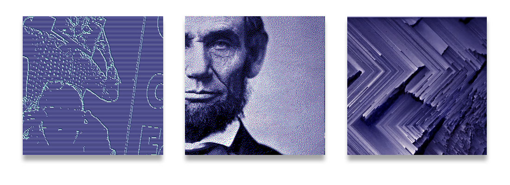
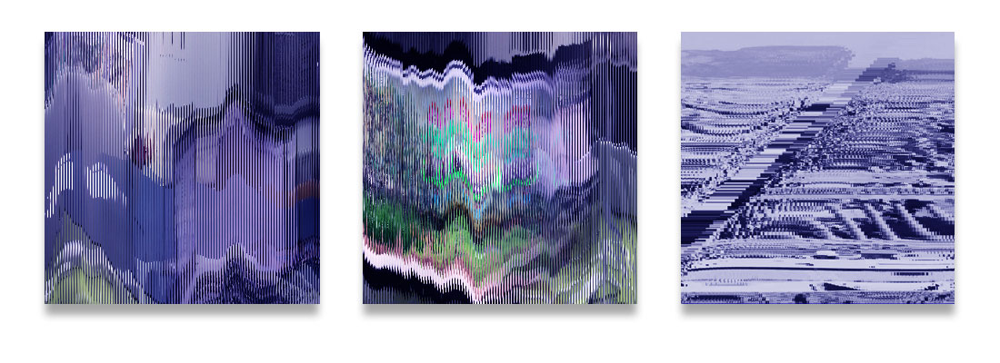

# Bildlabor 2023, Graphic Design HSLU

## Briefing
<a href="briefing.md">Read</a>

# Experimentierstationen
## Copy
Copy, Slitscan, Camera
## Pixel
Pixel Array Basic Manipulation, Edge Detection, Dither, Sorting
## Font
Text2Point, Variable Fonts
## Glitch 

## Interaktion
Time, Scrolling, Audio, Face Detection and Camera

*** 

## Basic Ressourcen
### Start in p5.js
* https://p5js.org/
* Basic Concepts: https://cathyatseneca.gitbooks.io/coding-projects-with-p5-js/content/
* Daniel Shiffman Coding Train: https://thecodingtrain.com/tracks/code-programming-with-p5-js
* https://github.com/processing/p5.js/wiki
* https://github.com/mattdesl/workshop-p5-intro 
* http://www.generative-gestaltung.de/2/
* https://generativeartistry.com/tutorials/
* http://openhumanitiespress.org/books/download/Soon-Cox_2020_Aesthetic-Programming.pdf
* More Ressources, Books, Tutorials: https://github.com/terkelg/awesome-creative-coding#books

### HTML und CSS

### Vanilla JavaScript

### Texte 
* <a href="2010_Original_Rosa-Menkman-Glitch-Studies-Manifesto.pdf" target="_blank">Rosa Menkman, Glitch Manifesto</a>
* <a href="McLuhan_Fiore--Medium is the Massage.pdf" target="_blank">Marshall McLuhan/Quentin Fiore, The Medium is the Message </a>